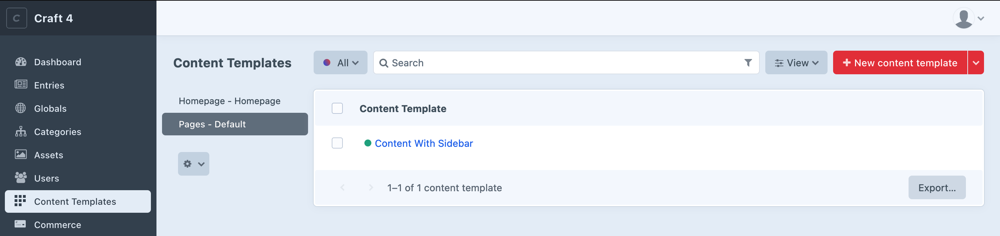
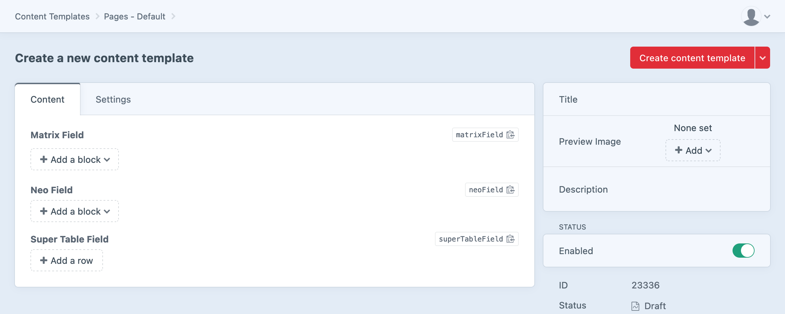
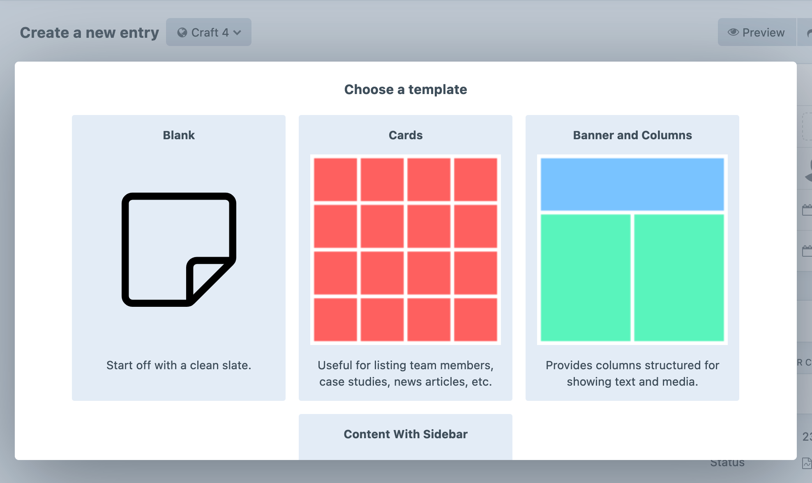

# Usage

## Creating content templates

In an environment where admin changes are allowed, open the Content Templates option on the Craft control panel sidebar. You'll see a typical element index page, with a list of all entry types.

Select an entry type you'd like to create a content template for, and select the 'New content template' button. You'll see a typical element editor page, with the fields from that entry type's field layout, and a few settings fields to the side:

- Title: the unique title that this content template will have.
- Preview image: An optional image to represent the template, selected from the folder chosen as the plugin's [preview source](plugin-settings.md).
- Description: an optional brief summary of the content this content template provides, or the type of pages it could be suitable for.

## Applying to entries

When creating a new entry for an entry type that's had content templates defined for it, a modal window will appear where you can select from one of those content templates, or start off with a blank entry.

This will also occur when opening an existing entry that has no content.

## Caveat: relation fields

Craft's project config is not intended to be used to store content, but as content-as-config is at the heart of Content Templates, this plugin uses the project config to sync content across environments. This means that relation fields (entries, assets, categories etc.), and any other fields that store their values as element/model IDs, might not be referring to the same element/model in different environments. Therefore, **we do not support the use of Content Templates with relation fields or any other similar fields**.
